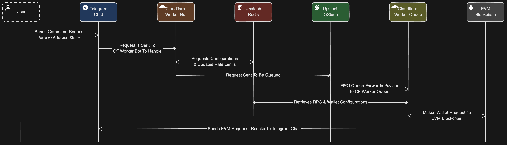

# Telegram EVM Faucet Bot

A Telegram bot using Cloudflare Workers and Upstash to give users either native gas tokens or erc20 tokens.

## Architecture Diagram



## Requirements

- NVM or NodeJS `v20.14.0` or greater
- [Cloudflare Worker](https://workers.cloudflare.com) account
- [Upstash Redis](https://upstash.com/docs/redis/overall/getstarted) account
- [Upstash Qstash](https://upstash.com/docs/qstash/overall/getstarted) account

## Setup & Deployment

Make sure after the bot is deployed to go through the [Initial Bot Configuration](#initial-bot-configuration).

Steps to get up and running:

### Step 1 - Install Dependencies

```bash
# FROM: ./telegram-evm-faucet-bot

pnpm install;

# [Expected Output]:
# Scope: all 3 workspace projects
# Lockfile is up to date, resolution step is skipped
# Already up to date
# Done in 1.9s
```

### Step 2 - Login To Cloudflare With Wrangler

```bash
# FROM: ./

pnpm cf:login;

# [Expected Equivalent Output]:
# > telegram-evm-faucet-bot@ cf:login /path/to/# telegram-evm-faucet-bot
# > wrangler login
#
#  ⛅️ wrangler 3.67.1 (update available 3.74.0)
# -------------------------------------------------------
#
# Attempting to login via OAuth...
# Opening a link in your default browser: https://dash.cloudflare.com/oauth2/...
```

Double check that you are successfully logged in with the following command:

```bash
# FROM: ./

pnpm cf:whoami;

# [Expected Equivalent Output]:
# > telegram-evm-faucet-bot@ cf:whoami /path/to/telegram-evm-faucet-bot
# > wrangler whoami
#
#  ⛅️ wrangler 3.67.1 (update available 3.74.0)
# -------------------------------------------------------
#
# Getting User settings...
# 👋 You are logged in with an OAuth Token, associated with the email <YOUR_CF_EMAIL>!
# ┌────────────────────────┬──────────────────────────────────┐
# │ Account Name           │ Account ID                       │
# ├────────────────────────┼──────────────────────────────────┤
# │ <YOUR_CF_ACCOUNT_NAME> │ <YOUR_CF_ACCOUNT_ID>             │
# └────────────────────────┴──────────────────────────────────┘
# 🔓 Token Permissions: If scopes are missing, you may need to logout and re-login.
# Scope (Access)
# - account (read)
# - user (read)
# - workers (write)
# - workers_kv (write)
# - workers_routes (write)
# - workers_scripts (write)
# - workers_tail (read)
# - d1 (write)
# - pages (write)
# - zone (read)
# - ssl_certs (write)
# - ai (write)
# - queues (write)
# - offline_access
```

### Step 3 - Configure Environment Variables

Following the environments variables defined in `./apps/bot/.dev.vars` and `./apps/queue/.dev.vars` you will need run commands in both app folders.

> **HELP:** Where do I get these environment variables?
>
> - See [TELEGRAM_API_TOKEN.md](./README/TELEGRAM_API_TOKEN.md)
> - See [UPSTASH_REDIS.md](./README/UPSTASH_REDIS.md)
> - See [UPSTASH_QSTASH.md](./README/UPSTASH_QSTASH.md)
> - See [CLOUDFLARE_WORKER.md](./README/CLOUDFLARE_WORKER.md)

#### Bot Environment Variables / Secrets

```bash
# FROM: ./apps/bot

# Enter values for prompts for each:
pnpm dlx wrangler secret put TELEGRAM_API_TOKEN;

pnpm dlx wrangler secret put UPSTASH_REDIS_REST_URL;

pnpm dlx wrangler secret put UPSTASH_REDIS_REST_TOKEN;

pnpm dlx wrangler secret put UPSTASH_QSTASH_TOKEN;

pnpm dlx wrangler secret put UPSTASH_QSTASH_QUEUE;

pnpm dlx wrangler secret put CLOUDFLARE_WORKER_QUEUE_URL;
# NOTE: `CLOUDFLARE_WORKER_QUEUE_URL` can only be set after the cloudflare workers are deployed

# In case of mistake, you can always run:
# pnpm dlx wrangler secret delete <KEY>;
```

#### Queue Environment Variables / Secrets

```bash
# FROM: ./apps/queue

# Enter values for prompts for each:
pnpm dlx wrangler secret put TELEGRAM_API_TOKEN;

pnpm dlx wrangler secret put UPSTASH_REDIS_REST_URL;

pnpm dlx wrangler secret put UPSTASH_REDIS_REST_TOKEN;

pnpm dlx wrangler secret put UPSTASH_QSTASH_CURRENT_SIGNING_KEY;

pnpm dlx wrangler secret put UPSTASH_QSTASH_NEXT_SIGNING_KEY;
```

#### Webhook Environment Variables

```bash
# FROM: ./packages/webhook

cp .env.example .env;

# Then add `TELEGRAM_API_TOKEN` and `CLOUDFLARE_WORKER_BOT_URL` to the file
# NOTE: `CLOUDFLARE_WORKER_BOT_URL` can only be set after the cloudflare workers are deployed
```

#### Commands Environment Variables

```bash
# FROM: ./packages/commands

cp .env.example .env;

# Then add `TELEGRAM_API_TOKEN` to the file
```

### Step 4 - Deploy

This will deploy all the following:

- `bot` needed to handle admin and commands
- `queue` the queued service to handle processing wallet transactions

```bash
# FROM: ./

# Important to add `run` because `deploy` by itself it reserved
pnpm run deploy;
```

### Step 5 - Set Telegram Bot Webhook

Remember you need the following environment variables in `./packages/webhook/.env` set before hand.

Set the Telegram Bot Webhook URL with the following command:

```bash
# FROM: ./

pnpm webhook;
```

### Step 6 - Set Telegram Bot Commands

Remember you need the following environment variables in `./packages/commands/.env` set before hand.
This will update the Telegram Bot Menu for easy commands.

```bash
# FROM: ./

pnpm commands;
```

## Initial Bot Configuration

Once the setup and deployment is complete, this will walk you through the steps that will be needed to first setup your telegram faucet bot.

### Step 1 - Start Activating Superadmin

Start a conversation with your bot and send a `/start` command.

This will set your username as the Superadmin.

### Step 2 - Set RPC Details

Make sure you have a wallet private key handy before configuring this and run a similar command.

```bash
# 1 = e.g. chain ID
# chainName = e.g. Berachain
# http://rpcurl.com = Main RPC endpoint e.g. https://bartio.rpc.berachain.com
# $abdc = native gas token e.g. $bera
# 18 = native gas token decimals e.g. 18
# http://blockexplorerurl.com = Main block explorer e.g. https://bartio.beratrail.io
# 0x1234567890abcdef = Wallet private key e.g. 0x...
/rpc set 1 chainName http://rpcurl.com $abcd 18 http://blockexplorerurl.com 0x1234567890abcdef
```

### Step 3 - Set Drip Configuration

Set the default faucet drip for the native gas token and/or erc20 token.

```bash
# $token = native gas token or erc20 e.g. $bera or $honey
# 0.1 = amount to drip e.g. 0.1 $bera
# 5m = interval time before a user can make another request e.g. 10m or 4h
/drip set $token 0.1 5m;
```

Confirm the settings with the following:

```bash
/drip settings
```

### Step 4 - Add Tokens (Optional)

You can optionally add more erc20 to support dripping.

```bash
# $token = an erc20 token e.g. $honey
# 0xAddress = erc20 address e.g. 0x1234...
# 18 = number of decimals for the token e.g. 18
/tokens add $token 0xAddress 18
```

Confirm the tokens with the following:

```bash
/tokens
```

## Local Development

(Coming Soon)
