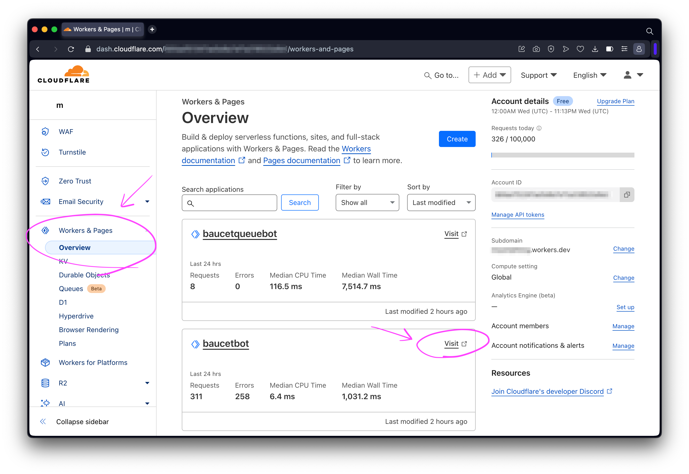
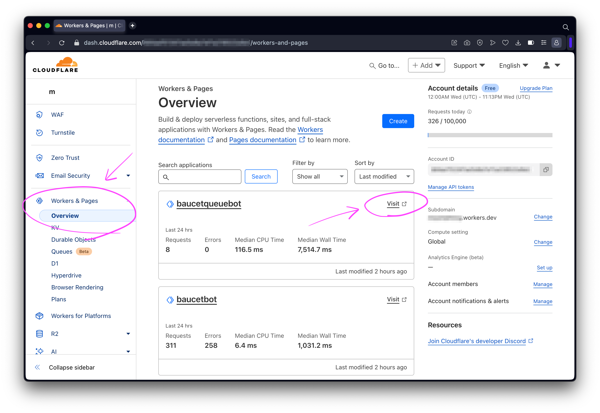

# How To Retrieve Cloudflare Worker Queue Environment Variables

This will walk you through the steps of getting the following environment variables from the [Cloudflare Dashboard](https://dash.cloudflare.com/).

- `CLOUDFLARE_WORKER_BOT_URL`
- `CLOUDFLARE_WORKER_QUEUE_URL`

## Step 1 - Make Sure Your Bot Is Already Deployed

Make sure that you've already deployed both your Cloudflare Workers with the following:

```bash
# FROM: ./

pnpm run deploy;
```

## Step 2 - Retrieve CLOUDFLARE_WORKER_BOT_URL

Go to **Workers & Pages** and copy the **Visit** URL for the bot.



## Step 3 - Retrieve CLOUDFLARE_WORKER_QUEUE_URL

Go to **Workers & Pages** and copy the **Visit** URL for the queue bot.



## Step 4 - Set Environment Variables

Update `CLOUDFLARE_WORKER_BOT_URL` and `CLOUDFLARE_WORKER_QUEUE_URL` wherever `.dev.vars` or `.env` is needed.
