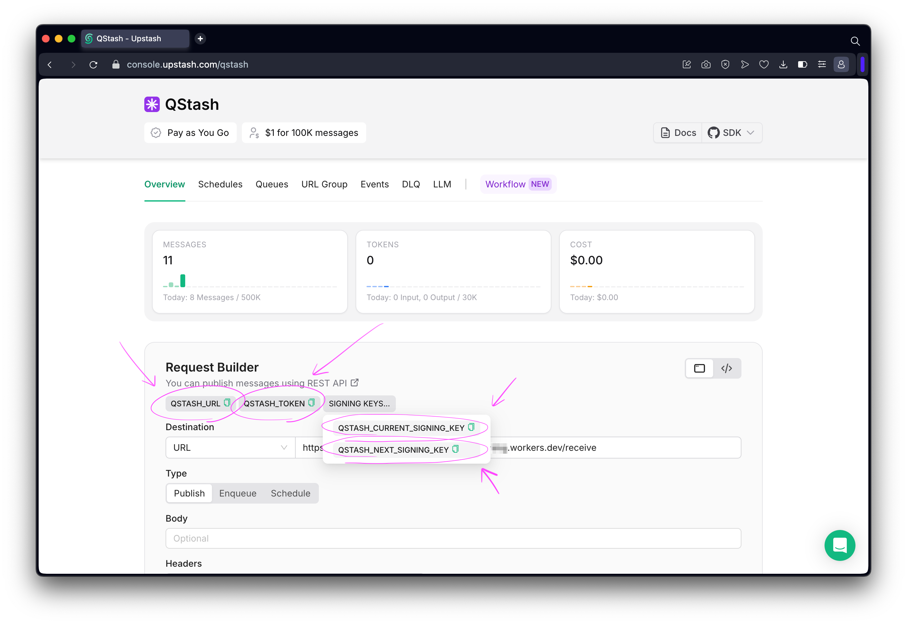
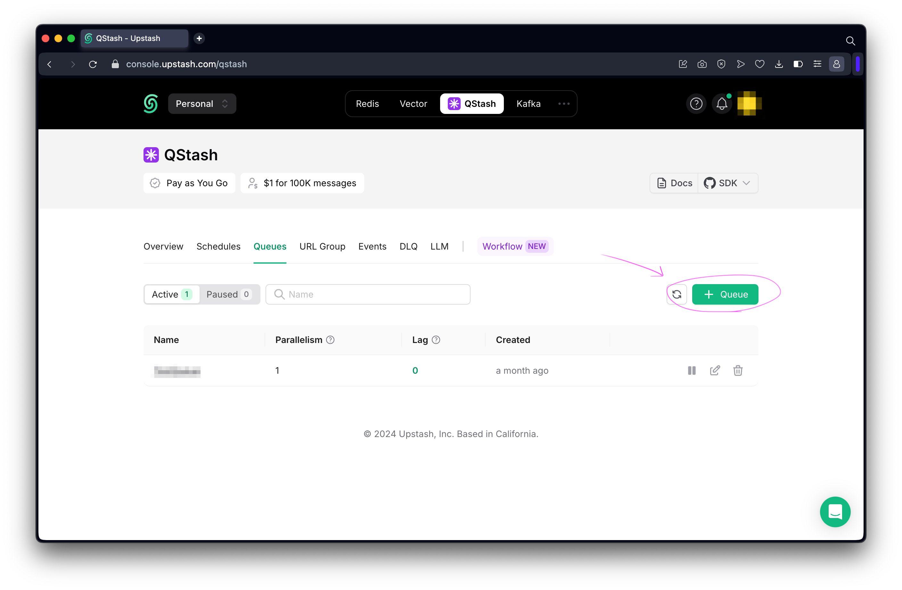
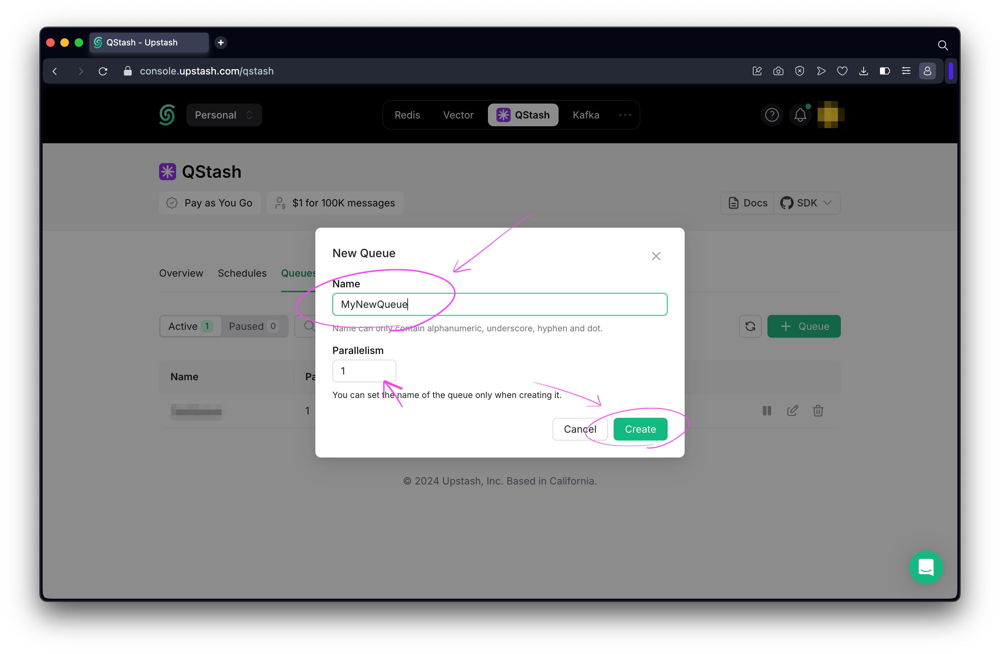

# How To Retrieve Upstash Redis Environment Variables

This will walk you through the steps of getting the following environment variables from [Upstash Qstash](https://console.upstash.com/qstash).

- `UPSTASH_QSTASH_TOKEN`
- `UPSTASH_QSTASH_CURRENT_SIGNING_KEY`
- `UPSTASH_QSTASH_NEXT_SIGNING_KEY`
- `UPSTASH_QSTASH_QUEUE`

## Step 1 - Sign Up For Upstash Account

Go to [https://console.upstash.com/login](https://console.upstash.com/login) and sign up for an account.

## Step 2 - Retrieve UPSTASH_QSTASH_TOKEN, UPSTASH_QSTASH_CURRENT_SIGNING_KEY, & UPSTASH_QSTASH_NEXT_SIGNING_KEY

Copy the `QSTASH_TOKEN`, `QSTASH_CURRENT_SIGNING_KEY`, and `QSTASH_NEXT_SIGNING_KEY` as:

- `UPSTASH_QSTASH_TOKEN`
- `UPSTASH_QSTASH_CURRENT_SIGNING_KEY`
- `UPSTASH_QSTASH_NEXT_SIGNING_KEY`

## Step 3 - Create New Queue

Go to [https://console.upstash.com/qstash](https://console.upstash.com/redis), go to the **Queues** section, and click `+ Queue`.

Set a new _Name_ (This is your `UPSTASH_QSTASH_QUEUE`), set the _Parallelism_ to `1` (Need to make sure there is any nonce conflicts with the wallet), and click `Create`.

This is now your new `UPSTASH_QSTASH_QUEUE`.

## Step 4 - Set Environment Variables

Update `UPSTASH_QSTASH_TOKEN`, `UPSTASH_QSTASH_CURRENT_SIGNING_KEY`, `UPSTASH_QSTASH_NEXT_SIGNING_KEY`, and `UPSTASH_QSTASH_QUEUE` wherever `.dev.vars` or `.env` is needed.
