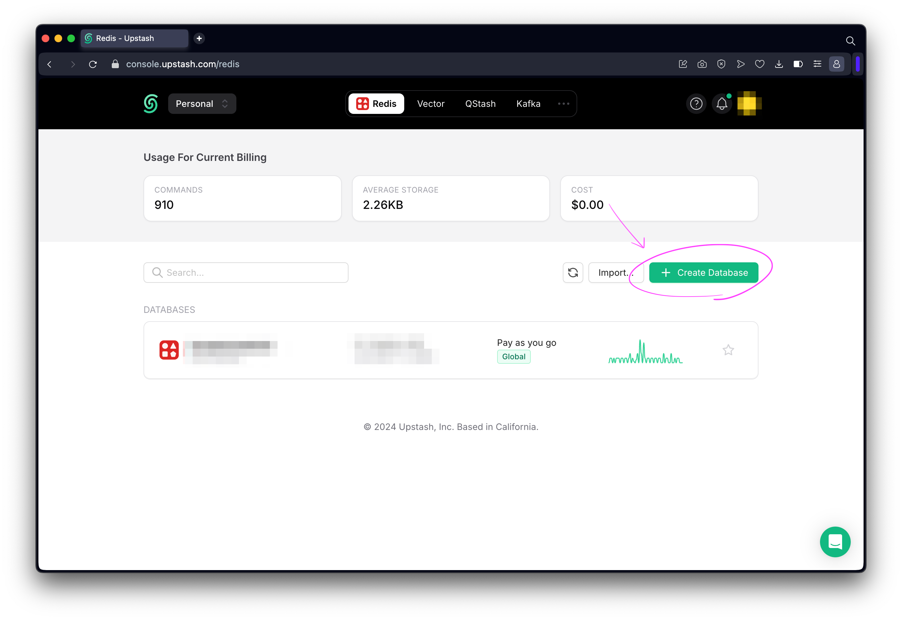
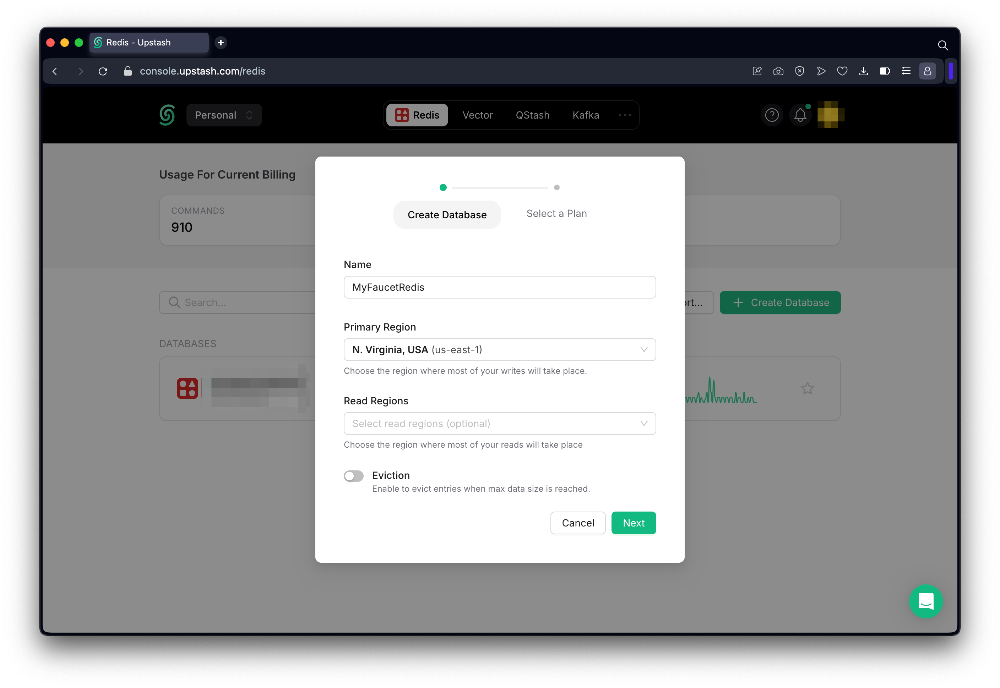
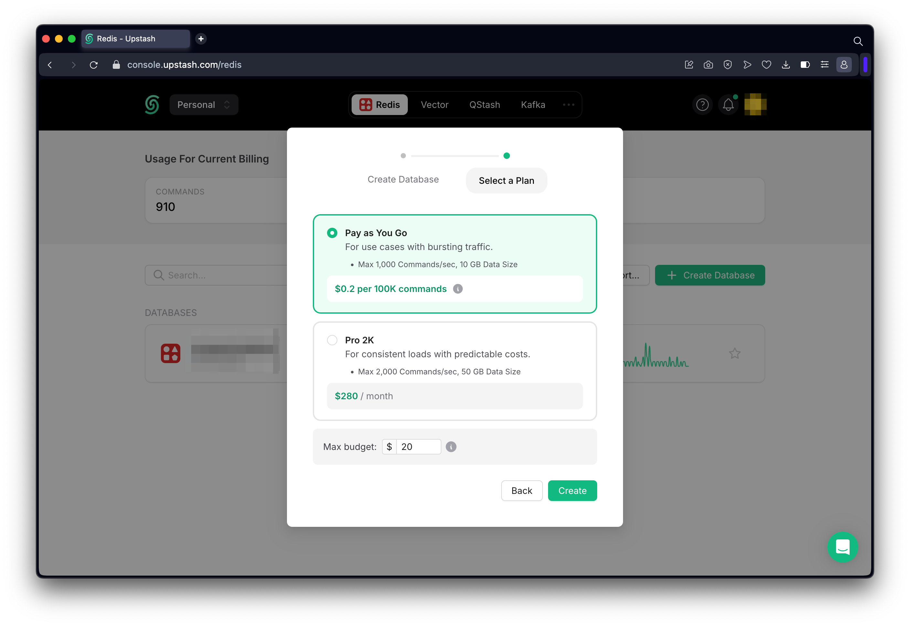
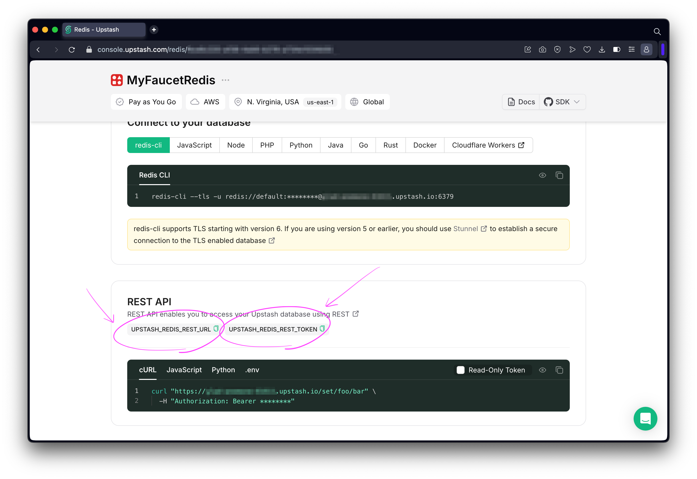

# How To Retrieve Upstash Redis Environment Variables

This will walk you through the steps of getting the following environment variables from [Upstash Redis](https://console.upstash.com/redis).

- `UPSTASH_REDIS_REST_URL`
- `UPSTASH_REDIS_REST_TOKEN`

## Step 1 - Sign Up For Upstash Account

Go to [https://console.upstash.com/login](https://console.upstash.com/login) and sign up for an account.

## Step 2 - Create New Redis Database

Go to [https://console.upstash.com/redis](https://console.upstash.com/redis) and click `+ Create Database`.

Enter a _Name_, _Primary Region_, and click `Next`

## Step 3 - Select Database Plan

Choose a plan and set a max budget.

## Step 4 - Retrieve UPSTASH_REDIS_REST_URL & UPSTASH_REDIS_REST_TOKEN

Copy both the `UPSTASH_REDIS_REST_URL` and `UPSTASH_REDIS_REST_TOKEN`.

## Step 5 - Set Environment Variables

Update `UPSTASH_REDIS_REST_URL` and `UPSTASH_REDIS_REST_TOKEN` wherever `.dev.vars` or `.env` is needed.
